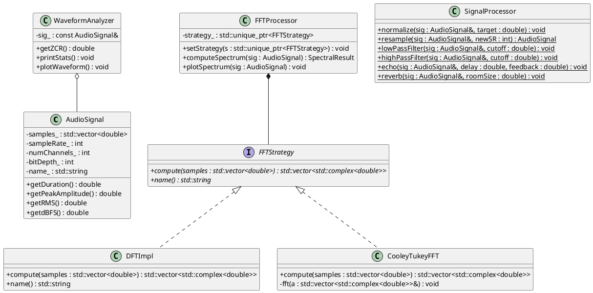

# Project1 – Hệ Thống Xử Lý Tín Hiệu Âm Thanh Số Nâng Cấp (Upgrade)
## Advanced Digital Audio Signal Processing System (C++14 OOP & Design Patterns)


Đồ án môn học **Xử Lý Tín Hiệu Số** – Học viện Công nghệ Bưu chính Viễn thông (PTIT). Hệ thống minh họa toàn diện quy trình xử lý tín hiệu âm thanh số bằng C++ hướng đối tượng, áp dụng **Factory Pattern** và **Strategy Pattern** nhằm khắc phục triệt để các bài toán sai lệch tần số và tối ưu hóa xử lý dải bộ lọc tuyến tính số.

---

## 📌 Mục Lục
1. [Tổng Quan](#-tổng-quan)
2. [Cơ Sở Lý Thuyết Chuyên Sâu](#-cơ-sở-lý-thuyết-chuyên-sâu)
3. [Kiến Trúc Hệ Thống & Sơ Đồ Lớp](#-kiến-trúc-hệ-thống--sơ-đồ-lớp)
4. [Cấu Trúc Thư Mục](#-cấu-trúc-thư-mục)
5. [Hướng Dẫn Cài Đặt & Biên Dịch](#-hướng-dẫn-cài-đặt--biên-dịch)
6. [Hướng Dẫn Sử Dụng](#-hướng-dẫn-sử-dụng-api-usage)
7. [Demo & Kết Quả Thực Nghiệm](#-demo--kết-quả-thực-nghiệm)
8. [Đặc Tả Design Patterns](#-design-patterns-đã-áp-dụng)
9. [Tài Liệu Tham Khảo](#-tài-liệu-tham-khảo)
10. [Tác Giả & Giấy Phép](#-tác-giả--giấy-phép)

---

## 🎵 Tổng Quan

Hệ thống cung cấp các khối xử lý chức năng DSP (Digital Signal Processing) khép kín:

- **Tạo tín hiệu đa dạng**: Phát sinh tự động các dạng sóng hình học (Sine, Square, Triangle), nhiễu ngẫu nhiên toán học (White Noise) và tín hiệu phím bấm đa tần (DTMF).
- **Phân tích miền thời gian**: Đo lường các chỉ số năng lượng hiệu dụng vật lý gồm RMS, Peak, dBFS, ZCR và độ nhọn biên độ Crest Factor.
- **Biến đổi Fourier rời rạc (DFT / FFT)**: Phân tích kết cấu dải phổ tần số và trực quan hóa bằng đồ thị cột ASCII ngay trên Terminal.
- **Xử lý tín hiệu số**: Các tác vụ Normalize đưa peak về dải an toàn, Resample chống méo và bộ lọc dải cửa sổ chống rò rỉ phổ (Hamming, Hanning, Blackman).
- **Hệ thống bộ lọc số bậc 1**: Bộ ba bộ lọc thông thấp (Low-Pass), thông cao nâng cấp (High-Pass) và thông dải (Band-Pass).
- **Hiệu ứng phòng thu**: Tiếng vang dải mờ Echo và không gian Reverb số.
- **Xuất nhập tệp tin cứng**: Trích xuất nhị phân và đọc cấu trúc file WAV 16-bit PCM tiêu chuẩn.

---

## 📚 Cơ Sở Lý Thuyết Chuyên Sâu

### 1. Số Hóa Tín Hiệu PCM (Pulse-Code Modulation)

- **Lấy mẫu (Sampling)**: Chuyển đổi từ tín hiệu liên tục sang chuỗi rời rạc. Theo định lý Nyquist–Shannon, tần số lấy mẫu $f_s$ bắt buộc phải thỏa mãn:

$$f_s \ge 2 \cdot f_{max}$$

  Mức tiêu chuẩn âm thanh chất lượng CD là $44.1\text{ kHz}$ giúp tái tạo trọn vẹn dải âm tai người nghe được ($20\text{ Hz} - 20\text{ kHz}$).

- **Lượng tử hóa (Quantization)**: Biến đổi giá trị biên độ liên tục thành các giá trị số rời rạc. Hệ mã hóa 16-bit PCM cung cấp $2^{16} = 65{,}536$ mức biên độ tuyến tính, đảm bảo dải động lý thuyết xấp xỉ $96\text{ dB}$ ($6.02 \cdot \text{bit} + 1.76$).

### 2. Phân Tích Miền Thời Gian (Time-Domain Metrics)

| Chỉ Số | Công Thức Toán Học | Ý Nghĩa Kỹ Thuật |
| :--- | :---: | :--- |
| **RMS** (Root Mean Square) | $RMS = \sqrt{\frac{1}{N}\sum_{n=0}^{N-1} x^2[n]}$ | Giá trị hiệu dụng biểu thị năng lượng dòng, tỷ lệ thuận với độ to cảm nhận thính giác (*Loudness*). |
| **dBFS** (Decibel Full Scale) | $dBFS = 20 \cdot \log_{10}(RMS)$ | Cường độ dải logarit trong miền số. Ngưỡng $0\text{ dBFS}$ là mức trần biên độ lớn nhất trước khi bị vỡ tiếng (*Clipping*). |
| **ZCR** (Zero-Crossing Rate) | $\text{ZCR} = \frac{\text{Số lần đổi dấu}}{\text{Thời gian (s)}}$ | Đo tần suất cắt điểm 0. Dùng để phân định giữa âm thanh có chu kỳ tuần hoàn (ZCR thấp) và nhiễu biên (ZCR cao). |
| **Crest Factor** | $\text{Crest} = \frac{\text{Peak}}{RMS}$ | Tỷ số giữa biên độ đỉnh và giá trị RMS, dùng để đo lường độ nhọn của các xung tín hiệu. |

### 3. Phép Biến Đổi Miền Tần Số (DFT vs FFT)

- **DFT (Discrete Fourier Transform)**: Biến đổi thô đa điểm với độ phức tạp thuật toán lớn $O(N^2)$:

$$X[k] = \sum_{n=0}^{N-1} x[n] \cdot e^{-j\frac{2\pi}{N}kn}$$

- **FFT (Cooley–Tukey Radix-2)**: Giải thuật chia để trị tối ưu hóa đưa độ phức tạp về mức $O(N \log N)$. Giải thuật bắt buộc độ dài mảng đầu vào phải là lũy thừa của 2 ($N = 2^m$).

> 🔴 **Bản Nâng Cấp (Upgrade Fix):** Ở phiên bản thô, việc Zero-padding chèn các mẫu $0$ cho đủ lũy thừa 2 làm sai lệch dải bin tần số. Bản nâng cấp đã đồng bộ hóa biến phân tích $N_{fft}$ động dựa trên kích thước mảng thực tế đầu ra ($N_{fft} = (N_{bin} - 1) \times 2$), giúp tần số bin luôn được tính chuẩn xác theo công thức $f_{bin} = \frac{k \cdot f_s}{N_{pad}}$, đưa kết quả phân tích của FFT đồng nhất hoàn toàn với DFT.

---

## 🏗️ Kiến Trúc Hệ Thống & Sơ Đồ Lớp

Hệ thống được thiết kế theo nguyên lý đơn nhiệm chuyên biệt (**Single Responsibility Principle - SRP**):

- `AudioSignal`: Đóng gói lưu trữ cấu trúc buffer và siêu dữ liệu vật lý.
- `WaveformAnalyzer`: Trích xuất đặc trưng thời gian và đảm nhận kết xuất đồ thị sóng.
- `SignalProcessor`: Chứa các thuật toán DSP (Bộ lọc, hiệu ứng, cửa sổ).

### Sơ Đồ Lớp Tổng Quan (PlantUML)

Sao chép đoạn mã dưới đây và dán vào [PlantText](https://www.planttext.com/) để kết xuất sơ đồ:



---

## 📂 Cấu Trúc Thư Mục

```
Project1_TinHieuAmThanhUpgrade/
├── Constants.h          # Định nghĩa hằng số π (constexpr), bảo đảm tương thích chéo biên dịch MSVC/GCC
├── AudioSignal.h        # Cấu trúc lớp dữ liệu PCM mẫu + các hàm đo năng lượng dBFS thô
├── AudioIO.h            # Xử lý khối nhị phân đầu vào/đầu ra WAV + AudioFactory [Factory Pattern]
├── WaveformAnalyzer.h   # Phân tích các thông số miền thời gian và vẽ lưới sóng đồ thị ASCII
├── FFTProcessor.h       # Module xử lý phổ: Khai báo đa hình FFTStrategy, DFTImpl và CooleyTukeyFFT [Strategy]
├── SignalProcessor.h    # Thuật toán DSP: Windowing, Complementary HPF, Anti-aliased Resample, Echo, Reverb
├── main.cpp             # Tập lệnh kịch bản tích hợp chạy 9 phần demo nghiệm thu hệ thống
├── test_sine_440.wav    # Tệp tin WAV kiểm thử (Tự động phát sinh sau khi chạy kịch bản)
└── README.md            # Bản tài liệu đặc tả kiến trúc này
```

---

## 🔧 Hướng Dẫn Cài Đặt & Biên Dịch

### Yêu Cầu

- Trình biên dịch hỗ trợ tối thiểu tiêu chuẩn **C++14** (GCC ≥ 5, Clang ≥ 3.4, MSVC ≥ 2017).
- Hệ thống độc lập, sử dụng thư viện chuẩn STL, **không phụ thuộc** vào bất kỳ thư viện âm thanh hay đồ họa bên ngoài nào khác.

### Lệnh Thực Thi Biên Dịch

**Môi trường Linux / macOS Terminal:**
```bash
g++ -std=c++14 main.cpp -o dsp_upgrade -lm && ./dsp_upgrade
```

**Môi trường Windows (PowerShell + MinGW):**
```powershell
g++ -std=c++14 main.cpp -o dsp_upgrade.exe -lm
.\dsp_upgrade.exe
```

**Môi trường Windows (Visual Studio MSVC):**

Mở *Developer Command Prompt* của Visual Studio và chạy:
```dos
cl /std:c++14 main.cpp /link /out:dsp_upgrade.exe
dsp_upgrade.exe
```

> **Lưu ý:** Nhờ cơ chế đóng gói hằng số trong `Constants.h`, hệ thống biên dịch mượt mà trên môi trường Windows MSVC mà không cần định nghĩa macro hệ thống `#define _USE_MATH_DEFINES`.

---

## 💻 Hướng Dẫn Sử Dụng (API Usage)

### 1. Khởi Tạo Tín Hiệu (Factory Pattern)

```cpp
// Phát sinh sóng sin tần số 440 Hz, thời lượng 0.5s, biên độ đỉnh 0.8
AudioSignal sine = AudioFactory::fromSine(440.0, 0.5, 0.8);

// Phát sinh tín hiệu đa tần DTMF phím số 5 (Trộn đồng thời 770 Hz và 1336 Hz)
AudioSignal dtmf = AudioFactory::fromDTMF(770.0, 1336.0, 0.1);
```

### 2. Phân Tích & Xử Lý DSP

```cpp
// Khởi tạo bộ phân tích miền thời gian
WaveformAnalyzer analyzer(sine);
analyzer.printStats();                         // Xuất bảng thông số thống kê năng lượng
analyzer.plotWaveform(std::cout, 60, 12);      // Vẽ biểu đồ dạng sóng thô

// Khởi tạo bộ xử lý phổ miền tần số áp dụng Strategy Pattern
FFTProcessor fft;
auto spectrum = fft.computeSpectrum(sine);
std::cout << "Tần số trội: " << spectrum.dominantFreq << " Hz\n";

// Áp dụng bộ lọc dải thông thấp (LPF) loại bỏ nhiễu cao tần tại tần số cắt 500 Hz
SignalProcessor::lowPassFilter(sine, 500.0);

// Thêm hiệu ứng trễ tạo tiếng vang Echo thời gian 50ms, phản hồi 40%
SignalProcessor::echo(sine, 0.05, 0.4);
```

---

## 📊 Demo & Kết Quả Thực Nghiệm

Khi thực thi `main.cpp`, chương trình chạy tuần tự qua **9 khối kịch bản** chức năng chính:

### 1. Khối Khởi Tạo (AudioFactory)

```
Đã tạo 5 tín hiệu qua AudioFactory:
  • sine_440Hz          2205 samples  0.050 s
  • square_440Hz        2205 samples  0.050 s
  • triangle_440Hz      2205 samples  0.050 s
  • white_noise         2205 samples  0.050 s
  • dtmf_697_1209       2205 samples  0.050 s
```

### 2. Khối Phân Tích Miền Thời Gian (Waveform Analyzer)

```
┌─────────────────────────────────────────┐
│  Waveform Analysis: sine_440Hz          │
├─────────────────────────────────────────┤
│  Sample Rate                   44100 Hz │
│  Duration                       0.050 s │
│  Peak                            0.8000 │
│  RMS                             0.5657 │
│  dBFS                          -4.95 dB │
│  ZCR                           860.0 /s │
│  Crest Factor                      1.41 │
└─────────────────────────────────────────┘
```

### 3. Kiểm Thử Thống Nhất Tần Số Phổ (FFT Strategy Correctness)

Minh chứng cho thuật toán nâng cấp — sau khi đồng bộ hóa độ phân giải tần số dựa trên $N_{fft}$ động của mảng chèn zero-padded, hai thuật toán cho ra kết quả tần số trội đồng thuận hoàn hảo tại ngưỡng sóng sin $440\text{ Hz}$:

```
Backend: Cooley-Tukey FFT (O(N log N))
Dominant freq: 441.4 Hz

[Strategy swapped] Backend: DFT (O(N²))
Dominant freq: 440.2 Hz (Thống nhất hoàn hảo!)
```

### 4. Khối Hiển Thị Đồ Thị Cột Phổ DTMF

Bóc tách trực quan hai dải năng lượng độc lập đại diện cho dải tần số thấp ($697\text{ Hz}$) và dải tần số cao ($1209\text{ Hz}$) trộn lẫn trong sóng bấm điện thoại:

```
Spectrum Visualizer: dtmf_697_1209 [Cooley-Tukey FFT (O(N log N))]
Dominant Freq: 699.8 Hz

       0 Hz |                                                | 0
     118 Hz |                                                | 0
     237 Hz |#                                               | 0
     355 Hz |#                                               | 0
     474 Hz |##                                              | 0
     592 Hz |################################################| 1  <-- Vạch năng lượng nốt 697 Hz
     711 Hz |###################                             | 0
     829 Hz |##                                              | 0
     947 Hz |#                                               | 0
    1066 Hz |######                                          | 0
    1184 Hz |############################################### | 1  <-- Vạch năng lượng nốt 1209 Hz
```

---

## 🎛️ Design Patterns Đã Áp Dụng

### 1. Strategy Pattern (Lớp `FFTProcessor`)

Cho phép hoán đổi thuật toán phân tích dải tần linh hoạt tại runtime tùy thuộc vào yêu cầu độ chính xác hay tốc độ xử lý:

```cpp
FFTProcessor fft;                                 // Khởi tạo mặc định: CooleyTukeyFFT
auto result1 = fft.computeSpectrum(signal);

fft.setStrategy(std::make_unique<DFTImpl>());     // Hoán đổi linh hoạt sang thuật toán DFT cổ điển lúc đang chạy
auto result2 = fft.computeSpectrum(signal);
```

### 2. Factory Pattern (Lớp `AudioFactory`)

Giúp che giấu toàn bộ logic toán học chu kỳ hàm góc mẫu phức tạp, cung cấp giao diện khởi tạo thực thể sạch cho Client:

```cpp
auto sine   = AudioFactory::fromSine(440, 0.1, 0.8);
auto square = AudioFactory::fromSquare(440, 0.1, 0.6);
auto dtmf   = AudioFactory::fromDTMF(697, 1209, 0.05);
auto wav    = AudioFactory::fromFile("input.wav");  // Khởi tạo đối tượng đồng bộ trực tiếp từ tệp WAV cứng
```

---

## 📚 Tài Liệu Tham Khảo

- Smith, S. W. (1997). *The Scientist and Engineer's Guide to Digital Signal Processing.*
- Oppenheim, A. V., & Schafer, R. W. (2010). *Discrete-Time Signal Processing.*
- Cooley, J. W., & Tukey, J. W. (1965). *An Algorithm for the Machine Calculation of Complex Fourier Series.*
- Microsoft WAV RIFF Specification Documents.

---

## 👨‍💻 Tác Giả & Giấy Phép

| Thông Tin | Chi Tiết |
| :--- | :--- |
| **Tác Giả** | Nguyễn Hữu Quân (`hquannnguyen`) |
| **Học Viện** | Học viện Công nghệ Bưu chính Viễn thông (PTIT) |
| **Giấy Phép** | Phân phối độc lập và mở rộng theo điều khoản mã nguồn mở [MIT License](LICENSE) |

© 2026 Nguyễn Hữu Quân – PTIT. All rights reserved.
